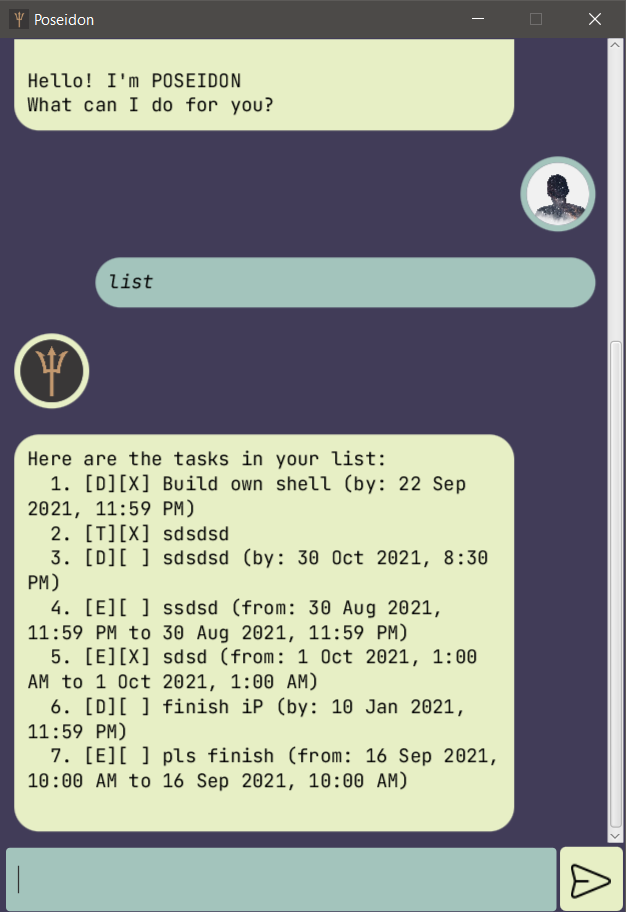

# User Guide

***P.O.S.E.I.D.O.N*** stands for
**P** lanner
**O** rganizer that's
**S** imple
**E** fficient
**I** ntelligent
**D** igital
**O** ptimized and
**N** ifty

P.O.S.E.I.D.O.N (Poseidon) is a **desktop application for keeping track of todo tasks, upcoming deadlines and planning events**. Poseidon's efficient and intelligent algorithm, combined with an optimized Command Line Interface (CLI) and a simple Graphical User Interface (GUI) gives you a fast and smooth user experience. If you can type fast, Poseidon can help you plan and organize your day faster than traditional GUI apps.

- [Quick Start](#quick-start)
- [Features](#features)
    - [help](#help)
    - [todo](#todo)
    - [deadline](#deadline)
    - [event](#event)
    - [done](#done)
    - [delete](#delete)
    - [list](#list)
    - [list sorted](#list-sorted)
    - [find](#find)
    - [bye](#bye)
- [Command Summary](#command-summary)

## Quick Start
1.  Ensure you have Java  `11`  or above installed on your Computer.

2.  Download the latest  `poseidon.jar`  from  [here](https://github.com/YeluriKetan/ip/releases).

3.  Copy the file to the folder you want to use as the  _home folder_  for your Poseidon.

4.  Double-click the file to start the app. The GUI similar to the below should appear in a few seconds. (If you face trouble opening the app this way, follow this [tutorial](#alternate-way))



5. Type the command in the command box and press Enter to execute it. For starters type `help` and press Enter to find out more about the commands you can use.

### Alternate way
Open up a command prompt and type in the following command.
```sh
java -jar poseidon.jar
```
## Features

### Help
Lists all the commands you can use

Syntax: `help`
e.g., `help`

### Todo
Add a Todo task with a description.

Syntax: `todo 'description'`
e.g., `todo Eat Dinner`

### Deadline
Add a Deadline task with a description and a by date and time.

Syntax: `deadline 'description' /by 'yyyy MM dd HHmm'`
e.g., `deadline finish project /by 2021 10 01 2359`

### Event
Add a Event task with a description, "from" date and time and a "to" date and time.

Syntax: `event 'description' /from 'yyyy MM dd HHmm' to 'yyyy MM dd HHmm'`
e.g., `event team meeting /from 2021 10 01 2000 to 2021 10 01 2200`

### Done
Marks a task as done based on index.

Syntax: `done 'index'`
e.g., `done 2`

### Delete
Deletes a task based on index.

Syntax: `delete 'index'`
e.g., `delete 3`

### List
Lists all the tasks with description, time and done status.

Syntax: `list'`
e.g., `list`

### List Sorted
Lists all the tasks with description, time and done status, sorted based on time.

Syntax: `list -s'`
e.g., `list -s`

### Find
Searches all the tasks based on the  given content and shows the results.

Syntax: `find 'content'`
e.g., `find 'meeting'`

### Bye
Exits the application.

Syntax: `bye`
e.g., `bye`

## Command Summary
Action|Command Format
------|--------------
FOR HELP|`help`
ADD TODO|`todo 'description`
ADD DEADLINE|`deadline 'description' /by 'yyyy MM dd HHmm'`
ADD EVENT|`event 'description' /from 'yyyy MM dd HHmm' to 'yyyy MM dd HHmm'`
MARK TASK DONE|`done 'index'`
DELETE TASK|`delete 'index'`
LIST TASKS|`list`
SORT TASKS|`list -s`
FIND CONTENT|`find 'content'`
EXIT|`bye`
